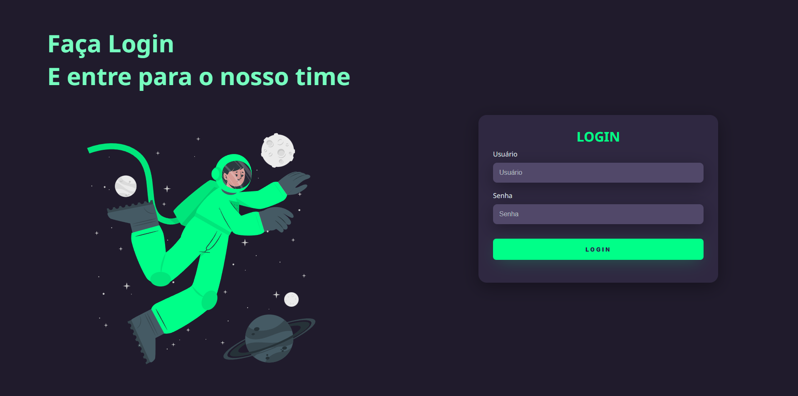
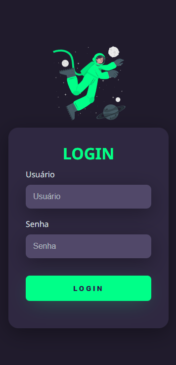

# **Página de Login**

O objetivo desse projeto foi criar uma página responsiva utilizando somente HTML e CSS para reforçar os conhecimentos nas duas tecnologias.

### **Desktop**

### **Mobile**

## **Referências**
Esse projeto foi criado a partir de um tutorial do canal “[**Markzuel**](https://www.youtube.com/@Markzuel)”.

Link do tutorial: “[**TELA DE LOGIN COM TEMA DARK | HTML E CSS**](https://www.youtube.com/watch?v=69-WfrVBli8&t=2049s&ab_channel=Markzuel)”

## **Contato ou sugestões**
 

